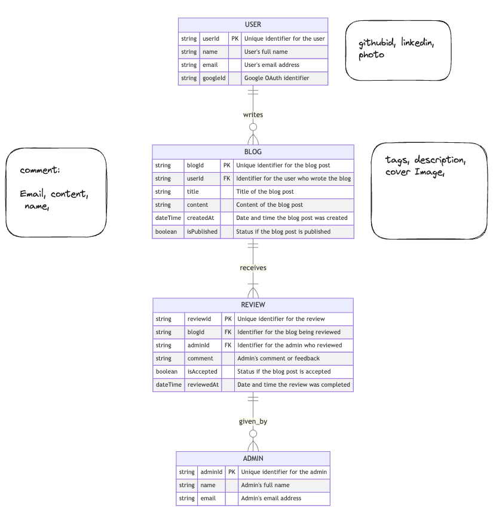
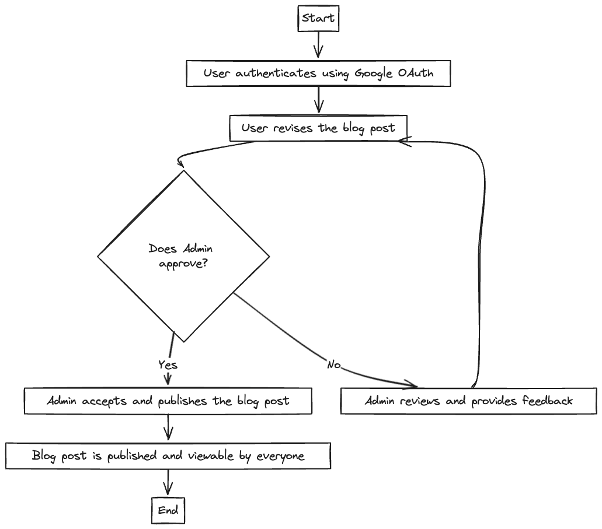
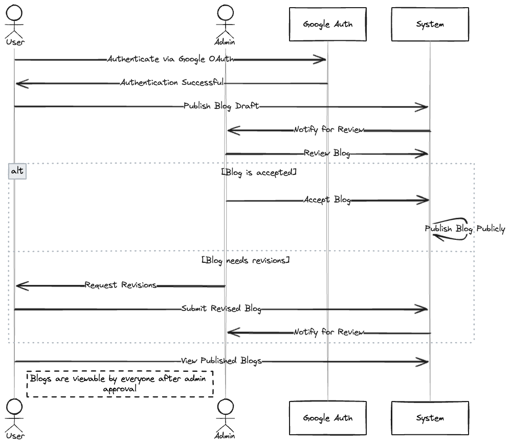

# Dev Docs

## dB schema:

- Tags:

  - name: String

- blogs:

  - title: String
  - content: String
  - tags: [Tags]
  - image: String
  - comments: Comments
  - review: enum('pending', 'approved', 'update')
  - reviewMessage: String

- Comments:

  - user: User
  - content: String
  - date: Date

- users:
  - email: String
  - name: String?
  - role: enum('admin', 'user')
  - newsletterIsSubscribed: Boolean
  - gAuth: any

## API ROUTES:

- GET / @Public
  Return Hello World

- GET /auth/singin @Public
  gAuth

- POST /auth/singup @Public
  Register using gAuth

- GET /auth/logout @AuthGuard('jwt')
  Logout

- Get /newsletter/email @Public
  Send email for newsletter in dB

- blogs/getAll @Public
  Get all blogs

- blogs/get/:id @Public
  Get blog by id

- blogs/create @AuthGuard('jwt')
  Create blog

- blogs/comment/:id @AuthGuard('jwt')
  Comment on blog by id

- blog/search/tags=...?time=...?query=... @Public
  Example: /blog/search/tags=tag1,tag2?time=2020-01-01?query=hello
  Search blog by query

- blogs/update/:id @AuthGuard('jwt')
  Update blog by id

- admin/all @AuthGuard('jwt') @@Admin Only
  Get all blogs where review is pending

- admin/blog/review @AuthGuard('jwt') @@Admin Only
  Review blog

- admin/blog/delete @AuthGuard('jwt') @@Admin Only
  Delete blog

- POST admin/newsletter @AuthGuard('jwt') @@Admin Only
  req: {
  access_token:<access_token>,
  subject:<subject, TEXT>,
  message:<message, HTML>,
  }
  Send email to all users in newsletter

## Client:

- Routes:

  - /blogs
  - /blogs/:id
  - /blogs/create
  - /blogs/update/:id
  - /admin
  - /admin/blogs/review/:id
  - /admin/blogs/delete/:id
  - /admin/newsletter

## Db-Schema:

## UI:

> TBD

> FIGMA LINK

## FlowChart:

## Sequence Diagram:

